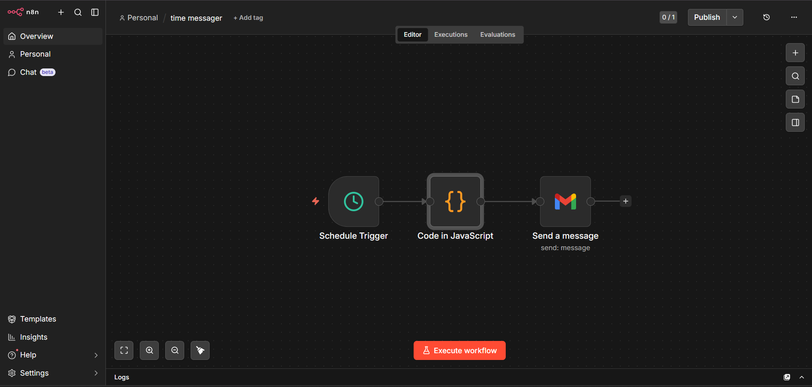

## 📸 Workflow Screenshot

## ⚙️ Setup Instructions

1. Open your n8n instance.
2. Download the workflow JSON file from this repository.
3. Import the JSON workflow into n8n.
4. Connect your Gmail account using n8n credentials.
5. Configure the Schedule Trigger.
6. Update the recipient email address, subject, and message if required.
7. Test the workflow.
8. Activate the workflow.

## 🔐 Security

- Never upload Gmail credentials, passwords, API keys, or access tokens to GitHub.
- Use n8n credentials for authentication.
- Keep sensitive information private.
- The workflow shared in this repository does not contain private credentials.

## 📚 What I Learned

Through this project, I practiced:

- Building workflows using n8n
- Creating scheduled automations
- Using JavaScript in n8n
- Integrating Gmail with n8n
- Automating repetitive tasks
- Connecting multiple services through workflow automation

## 👨‍💻 Author

**Balaramakrishna Jasti**

Computer Science Student | AI & Automation Enthusiast

- GitHub: https://github.com/jastibalaramakrishna
- LinkedIn: https://www.linkedin.com/in/balaramakrishna-jasti-5866636b/
